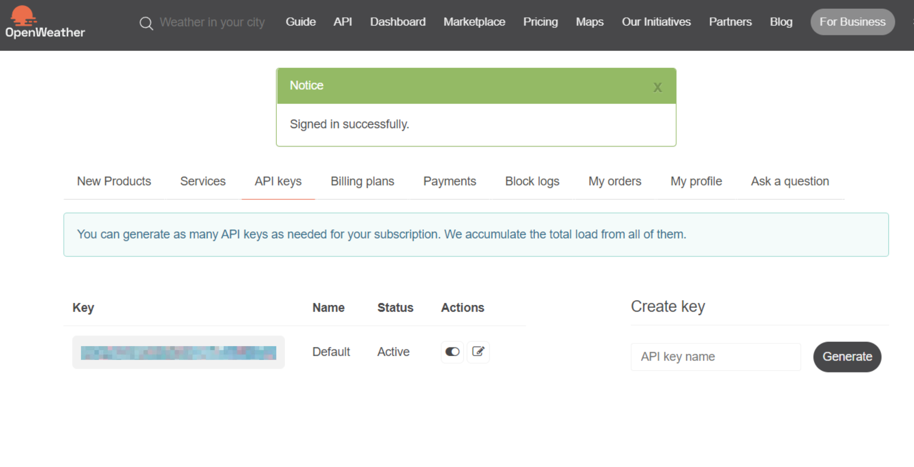
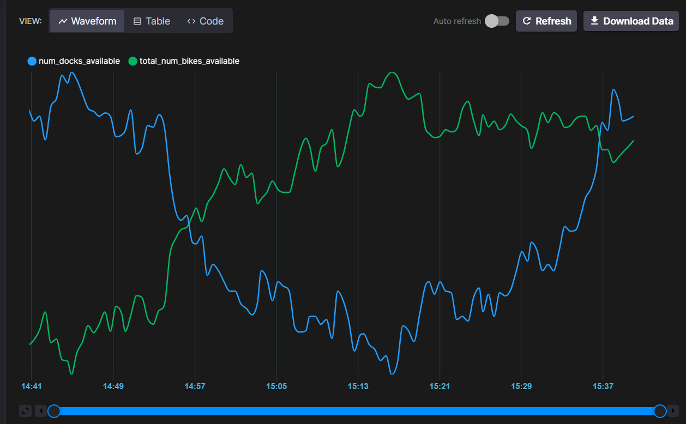

# Data Science with Quix: NY Bikes

Throughout this tutorial you will learn how to deploy a real-time data science project from scratch and into a scalable self-maintained solution. We will predict bike availability in New York by building the raw data ingestion pipelines, ETL and predictions. All in real time!

## Introduction

### Aim

Quix allows you to create complex and efficient real time infrastructure in a simple and quick way. To show you that, you are going to build an application that uses real time New York bikes and weather data to predict the future availability of bikes in New York.

In other words, you will complete all the typical phases of a data science project by yourself:

 - Build pipelines to gather bikes and weather data in real time

 - Store the data efficiently

 - Train some ML models with historic data

 - Deploy the ML models into production in real time

This will typically take several people (Data Engineers, Data Scientists) and weeks of work, however you will complete this tutorial in under 90 minutes using Quix.

### Prerequisites

1. You will need to know how to train an ML model.

	???- example "Want to learn it?"

		If you don't already know how to train an ML model, follow our "How to train an ML model" tutorial [here](../../tutorials/train-and-deploy-ml/train-ml-model.md).

		We walk you through the process of getting the code to access the data, running the code in a Jupyter notebook, training the model and uploading your pickle file to Quix.


2. You will need a Quix account and be logged into the [Portal](https://portal.platform.quix.ai/workspaces){target=_blank}. 

	!!! tip 

		Go [here](https://quix.io){target=_blank} to sign up if you need a free account.
	

### Overview 

This walk through covers the following steps:

1. Create OpenWeather account (third party)

2. Create a bikes data real time stream

3. Create a weather forecast data real time stream

4. Visualize the data

5. Get data to train a model

6. Deploy pre-trained ML models and produce predictions in real time

7. See the models output

## 1. Create OpenWeather account (free)

!!! info

	[OpenWeather](https://openweathermap.org/){target=_blank} is a team of IT experts and data scientists that provides historical, current and forecasted weather data via light-speed APIs.
	
1. Go to the [OpenWeather Sign Up page](https://home.openweathermap.org/users/sign_up/){target=_blank}.

2. Click the "Sign Up" button and complete the dialog. Do the email and text message verifications.

3. Then, go to the [OpenWeather API keys](https://home.openweathermap.org/api_keys){target=_blank} page to copy your key. Keep it safe for later.

## 2. Bikes real time stream

Start by getting the real time bikes stream. Use CityBikes to get real time bikes data (it doesn’t require a sign up or any keys).

Instead of writing a lot of code you will use the Library to deploy a pre-built service that streams data from the New York CitiBikes api.

1. Search the library for `New York` and select the `New York Bikes - Source` tile.

	{width=400px}

	!!! tip 
		The Library is on the left hand menu

2. Click `Setup and deploy`

	a. Leave the Name as it is
	
	b. Ensure the `output` is set to `bikes-topic`
	
3. Click `Deploy`

	The pre-compiled service will be deployed to your workspace and will begin running immediately.


## 3. Weather real time stream

You now have a working real time stream of bike data. Now use the OpenWeather account to create a real time weather stream. The procedure is almost the same, so you should have no problems!

1. Search the library for `weather` and select the `Open Weather API` tile.

2. Click `Setup and deploy`

	a. Leave the Name as it is
	
	b. Ensure the `output` is set to `weather-topic`

	c. Paste the key from your OpenWeather API keys page ([here](https://home.openweathermap.org/api_keys){target=_blank})

	{width=600px}

3. Click `Deploy`

	The pre-compiled service will be deployed to your workspace and will begin running immediately.

	!!! note "OpenWeather limitation"

		The OpenWeather API has limits on how much data we can access for free and the real weather only changes in real-time (this means slowly). 
		
		In order to prevent your account from being rate limited, we consume updated data every 30 minutes. (see more about this limitation later on in [training data](#training-data))

!!! success 

	At this stage you should have two services running

	

	One service publishing New York CitiBike data to a topic and another publishing OpenWeather data.

## 4. View and store the data

With Quix it's easy to visualize your data in a powerful and flexible way, you can see the real-time data and view historic data.

At it's heart Quix is a real-time data platform, so if you want to see data-at-rest for a topic, you must turn on data persistence for that topic (You'll do this [below](#historic)).

### Real-time

1. View the real-time data by clicking on the green arrow coming out of the `New York Bikes` service on the home page.

2. Click `Explore live data` on the context menu

3. Select a stream from the `select streams` list

4. Select the parameters in the `select parameters or events` list

5. Select the `Table` tab in the top middle of the screen

!!! tip "Be patient"

	If you don't see any streams or parameters, just wait a moment or two. The next time data arrives these lists will be automatically populated.

### Historic

In order to train a machine learning model we will need to store the data we are ingesting so that we start building a historic dataset. However topics are real time infrastructures, not designed for data storage. To solve this, Quix allows you to send the data going through a topic to an efficient real time database if you need it:

1. Navigate to the topics page using the left hand navigation

2. Locate the topic(s) you want to store data for (in this case `bikes-topic` and `weather-topic`)

3. Click the toggle in the Persistence column to `on`

4. Finally, go back to the homepage. 
	
	Now stop and then start the OpenWeather API service. This will collect and publish fresh data to the weather-topic.

## 5. Train your model

Quix gives you the freedom to train the ML model your way. If you already have tools and processes for doing that then great, you can train the model and import it into Quix so that you can run it in real-time. 

Follow the along and we'll show you how to get data out of Quix so you can train the model.

### Training data

We mentioned earlier in [Weather real time stream](#3-weather-real-time-stream) that free access to the OpenWeather API only allows us to consume new data every 30 minutes therefore, at this point you will have a limited data set.

You can leave the data consumption process running overnight or for a few days to gather more data, but for the time being there's no problem in continuing with the tutorial with your limited historic data.

#### Get the data

1. Click `Persisted data` in the left hand navigation

2. Select the `bikes-topic` in the left hand panel

3. Mouse over a stream name in the table and click the `Visualize stream` button

	The page will navigate to the `Data explorer`

4. In the query builder on the left hand side click the `+` under `SELECT (Parameters & Events)`

5. Select `total_num_bikes_available`

6. Click `+` again

7. Select `num_docks_available`

!!! success

	You should be looking at a visualization of the two selected parameters

	{width=600px}

8. Switch off `aggregation` to see all of the data

9. Select the `Code` tab to view the code to access this data set from outside of Quix

### Train the model

At this point, you are generating historic data and know how to query it. You can train your ML models as soon as you've gathered enough data.

!!! example "Need help?"

	Follow our "How to train an ML model" tutorial [here](../train-and-deploy-ml/train-ml-model.md)

	We walk you through the process of getting the code to access the data (as described above), running the code in a Jupyter notebook, training the model and uploading your pickle file to Quix.

However, it would take several weeks to accumulate enough historic data to train a model, so let's continue the tutorial with some pre-trained models we have provided. We've done it using the very same data flow you've just built, and can find the Jupyter notebook code we used [here](https://github.com/quixio/NY-bikes-tutorial/blob/1stversion/notebooks-and-sample-data/04%20-%20Train%20ML%20models.ipynb){target=_blank}.

## 6. Run the model

We have included our trained model artifacts as pickle files in the prediction code project and uploaded it to the open source library, so let's use them.

### Prediction service code

Get the code for the prediction service.

1. Click on the Library

2. Search for `New York` and select the `New york Bikes - Prediction` tile

3. Click `Edit code`

	a. Leave the Name as it is
	
	b. Ensure the `bike-input` is set to `bike-topic`

	c. Ensure the `weather-input` is set to `weather-topic`

	d. Ensure the `output` is set to `NY-bikes-prediction`

4. Click `Save as project`

	This will save the code for this service to your workspace

!!! note "Free Models" 

	Look in the `MLModels` folder. We've stashed the pre-trained ML models here for you. You can upload your own and compare them to ours. (Let us know how they compare)

### Run

You can now run the prediction model from this 'dev' environment to make sure it's working before deploying it to an always ready, production environment.

1. Click `run` in the top right hand corner.

2. Observe the `console` tab at the bottom of the screen.

	Any packages that are needed will be installed.
	
	Any topics that didn't previously exist will be created.
	
	Then the code will run.
	
	You will see a line similar to this in the console output.
	
	```shell
	Current n bikes: 23742 Forecast 1h: 23663 Forecast 1 day: 22831
	```
	
	!!! note "Data"
	
		For a new prediction to be generated, the service has to receive data from both bikes (updated often) and weather feeds (only updated every 30 mins).

		When you test the model, you may want to force the weather service to produce some new data (to avoid waiting for 30 mins) by restarting the service: stop it and then re-deploy it. By doing this it will start generating predictions sooner.
		
### Deploy

	With the code running we can deploy it to the Quix serverless environment. Here, it will run continuously, gathering data from the sources and producing predictions.
	
1. Click stop if you haven't already done so.

2. Click `Deploy` in the top right hand corner near `run`

3. On the `Deployment settings`, increase the memory to at least 1.5GB

4. Click `deploy`

	You will be redirected to the home page and the code will be built, deployed and started.
	
## 7. See the models output

Once the prediction service has started you can once more restart the 'Open Weather API' service and view the data.

You should be familiar with some of the following steps, they are very similar to '[Get the data](#get-the-data)' above.

1. Restart the 'Open Weather API' service

2. Click `Persisted streams` in the left hand menu

3. Click the toggle switch next to the `ny-bikes-prediction` topic to persist the data (wait for this to complete)

4. Mouse over the `stream name` of one of the rows in the table

5. Click the `Visualize stream` button

6. Select both of the parameters (`timestamp_ny_prediction` and `forecast_1d`)

7. You can select the `Waveform` tab to see a graphical representation of the forecast or select the `Table` tab to see the raw data.

!!! success
	
	You made it to the end! Give yourself a high five.
