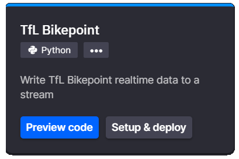

# Sending TFL BikePoint availability alerts to Slack

## Aim

In this tutorial you will learn how to use Quix to create event driven notifications in real-time. In this example we’ll connect to the Transport for London BikePoint API and send availability alerts to Slack using Slacks Webhooks.

By the end you will have:

 - Configured Slack to allow external services to send messages via WebHooks

 - Built and deployed a Quix Service that streams data received from the TFL BikePoint API

 - Received messages to your slack channel on the availability of bikes around London

!!! note 
	If at any point you run into trouble please reach out to us. We’ll be waiting for your message in [The Stream](https://quix.ai/slack-invite){target=_blank} our Slack community.

## Project Architecture

The solution has 2 main elements:

 - A Quix Service to pull TFL BikePoint data

 - A Slack Alerting Quix service

A Quix Service receives data from the Transport For London BikePoint API and streams the data onto the Quix message broker. Another service listens to the bike data stream. When the number of available bikes at a station falls below the desired level an alert is sent to the Slack channel via the Slack Webhook.

## Prerequisites

To proceed with this tutorial you need:

 - Quix portal login. (you'll need an account for this, go [here](https://portal.platform.quix.ai/self-sign-up/){target=_blank} and create one){target=_blank}

 - Access to Slack, you’ll need to be an admin.

 - A TFL account and API keys

	???- info "Getting your TFL API key"

		You’ll need a free TfL account which you can register for here: [https://api-portal.tfl.gov.uk/](https://api-portal.tfl.gov.uk/){target=_blank}

		A rough guide to finding your TfL API key is as follows:

		1. Register for an account.

		2. Login and click the `Products` menu item.

		3. You should have 1 product to choose from `500 Requests per min.`

		4. Click `500 Requests per min.`

		5. Enter a name for your subscription into the box, e.g. QuixFeed, and click `Register.`

		6. You can now find your API Keys in the profile page.

!!! tip
	Check out the projects README.md later on in the tutorial if you need help creating a Slack WebHook

## Overview

This walk through covers the following steps:

1. Creating a Slack App

2. Setup Webhooks

3. Deploy a service to pull TFL BikePoint data

4. Publish messages to Slack from Quix

## TFL BikePoint data

Obtaining data from TFL's BikePoint API is fairly straight forward. You need to make a request to the relevant API endpoint, passing the correct parameters and API keys. When data is returned, you'll need to process it and ensure it's in the correct format to publish to a Quix topic.

However, there is a much easier way to achieve the same outcome.

1. Navigate to the Quix library

2. Search for `TFL Bikepoint` and click the tile

	{width=300px}

3. Click `Setup & deploy`

4. Paste your TFL API keys into the `tfl_primary_key` and `tfl_secondary_key` input fields

5. Click `Deploy`

!!! success 

	You've deployed the TFL API microservice and it is publishing data to Quix

## Configure Slack

You'll need to be an admin on Slack for this.

### Slack App

Ensure you’re logged into the [Slack web portal](https://api.slack.com/messaging/webhooks){target=_blank} here then create a new app.

1. Click `Create your Slack app`

2. On the popup, select `From Scratch`

3. Enter a name and choose your workspace

4. Click `Create App`

### Webhooks

With the app created you'll now need to setup a webhook. This will give you a URL that you can use to publish messages to a Slack channel.

1. On the left hand menu under `Features` select the `Incoming Webhooks` menu item

2. Switch the slider to `On` to activate incoming Webhooks

3. Click the `Add New Webhook to Workspace` button

4. Select the channel you want to give access to and thus publish messages to

5. Click allow

6. Copy the `Webhook URL` near the bottom of the page. Keep this safe you will need it soon

## Integration

The time has come to actually connect Quix and Slack. Once again, with the help of the Quix Library, this is a simple task.

1. Navigate to the Library

2. Search for `Slack`

3. Click `Setup & deploy`

4. Ensure that the `input` is set to `tfl-bikepoint-data`

5. Past your Webhook URL into the `webhook_url` input box

6. Click `Deploy`

!!! success 

	You will see messages arriving in your chosen slack channel

	

## What’s Next

There are many ways you can use this code, try enhancing it so it only alerts you about each location once, or once every 5 minutes or perhaps only if the number of bikes drops below 2 rather than just every time it is 2.

Using Quix, coupled with something like Slack, allows for automatic real-time alerting. Quix allows you to react in real-time to events or anomalies found either in raw data or generated by ML models.

If you ran into trouble please reach out to us. We’ll be more than happy to help. We hang out at [The Stream](https://quix.ai/slack-invite){target=_blank}. Come and say hi.
